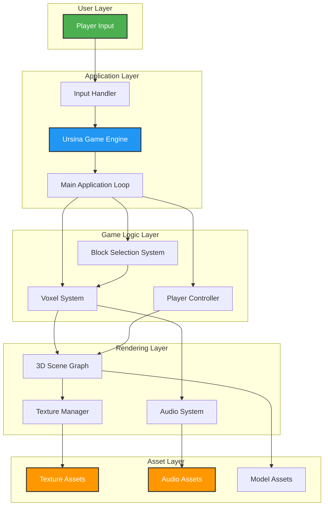
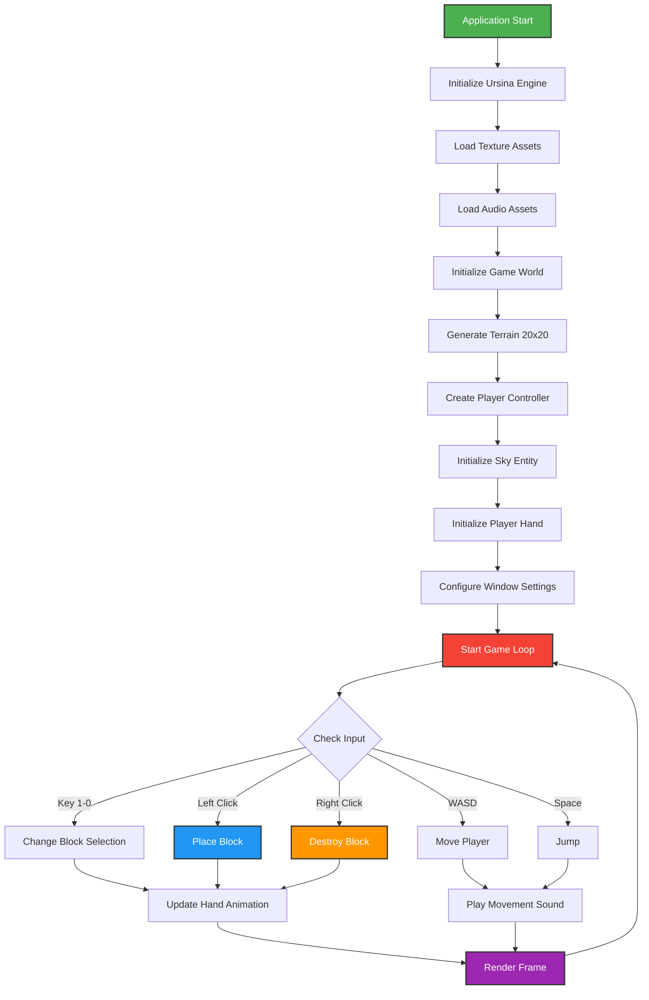

# Minecraft Clone using Ursina Engine :video_game:

> **Fun Fact:** Minecraft was originally created by Markus "Notch" Persson in 2009 as a voxel-based sandbox game. The term "voxel" comes from "volumetric pixel" - essentially a 3D pixel that represents value in three-dimensional space, just like the blocks in our game!

## Abstract

The Minecraft Clone is a Python-based voxel sandbox game built with the Ursina Engine. This project recreates the core mechanics of Minecraft, allowing players to build, explore, and interact with a 3D block-based world. Designed for learning and experimentation, it demonstrates fundamental game development concepts including 3D rendering, collision detection, player controls, and interactive voxel manipulation.

**Key Features:**
- First-person perspective (FPP) player controls
- Block placement and destruction mechanics
- 10 unique block types with distinct textures
- Interactive hand animations
- Spatial audio for block interactions
- Real-time FPS monitoring
- Customizable world dimensions

---

## Project Architecture

### System Architecture Diagram



### Game Flow Diagram



---

## File Architecture

### Directory Structure

```
Minecraft-Clone-Using-Ursina-Engine/
├── main.py                      # Application entry point: Ursina game initialization and main loop
├── requirements.txt             # Python dependencies with version constraints
├── README.md                    # Project documentation
├── LICENSE                      # MIT License
└── .gitignore                   # Git ignore rules
│
└── assets/
    ├── favicon_assets/
    │   ├── sword_favicon_icon.ico    # Application icon for window/taskbar
    │   └── sword.png                 # Sword icon for application
    │
    ├── graphical_assets/
    │   ├── diamond_ore_block.png     # Diamond ore block texture
    │   ├── emerald_ore_block.png     # Emerald ore block texture
    │   ├── gold_ore_block.png        # Gold ore block texture
    │   ├── leaves.png                # Tree leaves texture
    │   ├── obsidian.png              # Obsidian block texture
    │   ├── player_arm.png            # Player hand/arm texture
    │   ├── sand.png                  # Sand block texture (default)
    │   ├── sky.png                   # Sky sphere texture
    │   ├── sponge.jpg                # Sponge block texture
    │   ├── stone_block.png           # Stone block texture
    │   ├── stone_brick.png           # Stone brick texture
    │   └── wood_plank.jpg            # Wood plank texture
    │
    └── sound_assets/
        ├── block_sound.mp3           # Block place/destroy sound effect
        └── player_movement_sound.mp3 # Player movement audio feedback
```

---

## Prerequisites

### System Requirements

| Component | Version | Description |
|-----------|---------|-------------|
| Python | 3.13+ | Required runtime environment |
| pip | 23.0+ | Python package installer |
| Ursina Engine | 8.3.0+ | Game engine framework |
| OpenGL | 3.3+ | Graphics rendering API |
| RAM | 4GB+ | Minimum memory requirement |
| Storage | 100MB+ | Available disk space |

### Platform Support

| Platform | Status | Notes |
|----------|--------|-------|
| macOS (Intel) | ✅ Fully Supported | Native OpenGL support |
| macOS (Apple Silicon M1/M2/M3) | ✅ Supported | Runs via Rosetta 2 or native |
| Windows 10/11 | ✅ Fully Supported | DirectX/OpenGL |
| Linux (Ubuntu/Debian) | ✅ Fully Supported | OpenGL/Mesa drivers |

---

## Installation

### Step 1: Clone the Repository

```bash
git clone https://github.com/jaypatel15406/Minecraft-Clone-Using-Ursina-Engine.git
cd Minecraft-Clone-Using-Ursina-Engine
```

### Step 2: Create and Activate Virtual Environment

**macOS/Linux:**
```bash
python3 -m venv venv
source venv/bin/activate
```

**Windows (Command Prompt):**
```bash
python -m venv venv
venv\Scripts\activate.bat
```

**Windows (PowerShell):**
```bash
python -m venv venv
venv\Scripts\Activate.ps1
```

### Step 3: Install Dependencies

```bash
pip install -r requirements.txt
```

---

## Running the Game

### Start the Game

```bash
python main.py
```

The game window will open automatically with the following default settings:

| Setting | Value |
|---------|-------|
| Window Title | Minecraft Clone Using Ursina Engine |
| Resolution | Default (auto-detected) |
| Fullscreen | Disabled |
| FPS Counter | Enabled |
| World Size | 20x20 blocks (400 total) |

---

## Game Controls

### Movement Controls

| Key | Action | Description |
|:---:|--------|-------------|
| `W` | Move Forward | Walk forward in the direction you're facing |
| `A` | Move Left | Strafe left |
| `S` | Move Backward | Walk backward |
| `D` | Move Right | Strafe right |
| `Space` | Jump | Jump upward (hold for higher jump) |
| `Shift` | Fall | Hold to fall faster / disable freefall |
| `Mouse` | Look Around | Move mouse to change view direction |

### Block Selection Controls

| Key | Block Type | Description |
|:---:|------------|-------------|
| `1` | Sand Block | Default block, desert terrain style |
| `2` | Stone Block | Gray stone texture |
| `3` | Stone Brick | Decorative stone brick pattern |
| `4` | Wood Plank | Wooden plank texture |
| `5` | Leaves | Tree foliage texture |
| `6` | Obsidian | Dark purple/black decorative block |
| `7` | Sponge | Yellow sponge texture |
| `8` | Gold Ore Block | Gold ore with speckles |
| `9` | Diamond Ore Block | Diamond ore with blue crystals |
| `0` | Emerald Ore Block | Emerald ore with green crystals |

### Interaction Controls

| Action | Mouse Button | Description |
|--------|--------------|-------------|
| Place Block | Left Click | Place selected block on targeted face |
| Destroy Block | Right Click | Remove targeted block |

---

## Game Specifications

### World Configuration

| Specification | Value | Description |
|---------------|-------|-------------|
| Terrain Type | Desert Terrain | Flat sand-based starting world |
| World Dimensions | 20 x 20 | 400 total voxel area |
| World Time | Day Time | Bright daylight lighting |
| Player View | FPP | First-Person Perspective |
| Gravity | Enabled | Standard Minecraft physics |

### Active Features

| Feature | Status | Description |
|---------|--------|-------------|
| Player Freefall | ✅ Enabled | Players can fall from heights |
| Movement Sound | ✅ Enabled | Audio feedback for WASD movement |
| Block Sound Effects | ✅ Enabled | Audio for placing/destroying blocks |
| FPS Counter | ✅ Enabled | Real-time frame rate display |
| Hand Animation | ✅ Enabled | Arm moves when interacting with blocks |
| Fullscreen Mode | ❌ Disabled | Windowed mode by default |

---

## Customization Guide

### Modify World Size

To change the world dimensions, edit `main.py`:

```python
# Increase world size to 30x30 blocks (900 total)
dimension: int = 30
for i in range(dimension):
    for j in range(dimension):
        Voxel(position=(i, 0, j))
```

> **Note:** Larger worlds require more memory and may reduce FPS.

### Change Window Settings

Modify window configuration in `main.py`:

```python
# Enable fullscreen mode
window.fullscreen = True

# Hide FPS counter
window.fps_counter.enabled = False

# Change window title
window.title = 'My Custom Minecraft'
```

### Add New Block Types

1. **Add texture path to `BLOCK_TEXTURES` dictionary:**
   ```python
   BLOCK_TEXTURES = {
       'Sand Block': 'assets/graphical_assets/sand.png',
       'Your Block': 'assets/graphical_assets/your_texture.png',
   }
   ```

2. **Add texture loading:**
   ```python
   your_block_texture = load_texture(BLOCK_TEXTURES['Your Block'])
   ```

3. **Add to `TEXTURE_MAP`:**
   ```python
   TEXTURE_MAP = {
       'Sand Block': sand_block_texture,
       'Your Block': your_block_texture,
   }
   ```

4. **Add key binding in `KEY_BLOCK_MAP`:**
   ```python
   KEY_BLOCK_MAP = {
       '1': 'Sand Block',
       '2': 'Your Block',
   }
   ```

---

## Troubleshooting

### Common Issues

#### 1. ModuleNotFoundError: No module named 'ursina'

**Solution:**
```bash
# Ensure virtual environment is activated
pip install -r requirements.txt --upgrade
```

#### 2. Black Screen or No Textures Loading

**Solution:**
```bash
# Verify asset files exist
ls -la assets/graphical_assets/

# Check file permissions
chmod -R 755 assets/
```

#### 3. Audio Not Working

**Solution:**
- Check system volume settings
- Verify audio files exist: `ls assets/sound_assets/`
- Ursina requires OpenAL or similar audio backend

#### 4. Low FPS / Laggy Performance

**Solution:**
```python
# Reduce world size in main.py
dimension: int = 15  # Smaller world = better performance
```

#### 5. macOS Apple Silicon Issues

**Solution:**
```bash
# Run with Rosetta 2 translation
arch -x86_64 python main.py
```

#### 6. Mouse Cursor Not Captured

**Solution:**
- Press `Esc` to release/recapture mouse
- Click on game window to focus

---

## Development

### Code Structure

```
main.py                          # Entry point and game logic
├── Imports                      # Ursina engine and dependencies
├── Asset Loading                # Texture and audio initialization
├── Block Configuration          # Block type mappings
├── Update Function              # Per-frame input handling
├── Voxel Class                  # Block interaction logic
├── Sky Class                    # Sky sphere rendering
├── PlayerHand Class             # Hand animation system
└── World Generation             # Terrain initialization
```

### Code Modernization (Python 3.13+)

| Feature | Implementation |
|---------|---------------|
| Type Hints | All functions use `-> None`, `: str`, `: int`, etc. |
| Forward References | `from __future__ import annotations` |
| Dictionary Mapping | Block selection uses dict lookups instead of if-chains |
| Docstrings | Google-style documentation for all classes/functions |
| Snake Case | All files and folders follow PEP 8 naming conventions |

---

## Performance Optimization

| Optimization | Impact | How To |
|--------------|--------|--------|
| Reduce World Size | High | Set `dimension = 15` instead of 20 |
| Lower Resolution | Medium | Adjust window size in Ursina settings |
| Disable Sounds | Low | Comment out Audio initialization |

### Resource Usage

| Resource | Approximate Usage |
|----------|------------------|
| CPU | 10-30% (single core) |
| Memory | 200-500 MB |
| GPU | OpenGL 3.3+ required |
| Storage | 50 MB (assets included) |

---

## Contributing

### How to Contribute

1. **Find an Issue:** Browse [open issues](https://github.com/jaypatel15406/Minecraft-Clone-Using-Ursina-Engine/issues)

2. **Claim an Issue:** Comment: "Can I work on this?" on the issue

3. **Fork and Clone:**
   ```bash
   git clone https://github.com/YOUR_USERNAME/Minecraft-Clone-Using-Ursina-Engine.git
   cd Minecraft-Clone-Using-Ursina-Engine
   ```

4. **Create a Branch:**
   ```bash
   git checkout -b feature/issue-123-short-description
   ```

5. **Make Changes:**
   - Follow existing code style
   - Add type hints and docstrings
   - Test gameplay thoroughly

6. **Commit and Push:**
   ```bash
   git add .
   git commit -m "Fixes #123: Brief description of changes"
   git push origin feature/issue-123-short-description
   ```

7. **Create Pull Request:**
   - Title format: `Fixes #123: Issue Title`
   - Include description of changes
   - Reference related issues

---

## Future Enhancements

1. **World Generation:**
   - Procedural terrain generation
   - Biome system (desert, forest, mountains)
   - Cave and ore generation

2. **Building Features:**
   - Block crafting system
   - Inventory UI
   - Block stacking limits

3. **Gameplay:**
   - Day/night cycle
   - Weather system
   - Mob/creature spawning

4. **Multiplayer:**
   - Network multiplayer support
   - Server hosting capabilities

5. **Graphics:**
   - Shader support
   - Dynamic lighting
   - Water and lava physics

---

## Resources

- [Ursina Engine Documentation](https://www.ursinaengine.org/documentation.html)
- [Ursina Engine Samples](https://github.com/pokepetter/ursina/blob/master/samples/minecraft_clone.py)
- [Python Game Development with Pygame](https://realpython.com/pygame-a-primer/)
- [Blender for 3D Asset Creation](https://www.blender.org/)

---

## License

This project is licensed under the MIT License - see the [LICENSE](LICENSE) file for details.

---

## Support

For issues, questions, or contributions:

- **Bug Reports:** [GitHub Issues](https://github.com/jaypatel15406/Minecraft-Clone-Using-Ursina-Engine/issues)
- **Discussions:** GitHub Discussions tab
- **Email:** jaypatel15406@gmail.com

---

<div align="center">

**Built with ❤️ using Python and Ursina Engine**

*Happy Building!* 🎮🏗️

</div>
